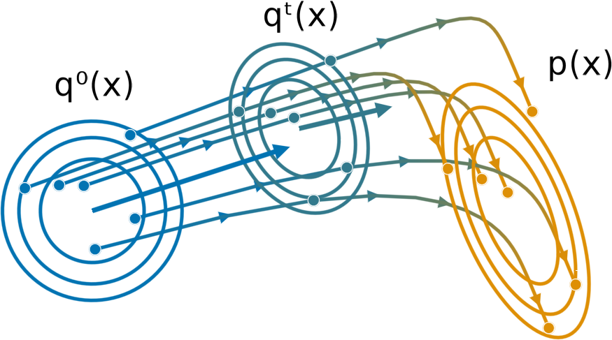

# Flexible and Efficient Inference with Particles for the Variational Gaussian Approximation

Repo containing experiments for the ICML submission : "Flexible and Efficient Inference with Particles for the Variational Gaussian Approximation"



## Installation

First of all [install julia](https://julialang.org/downloads/) with **version at least 1.5**.
Download this repository (there should be a `gpf_icml.zip` file) and unzip it somewhere.
With a terminal go to the repo and run `julia`.
Then make the following calls:
```julia
using Pkg
Pkg.activate(".")
Pkg.instantiate()
Pkg.develop(path"./AdvancedVI")
```

To download the relevant datasets from Section 4.3, you can simply call
```julia
include("scripts/download_and_convert.jl")
```

You are now all set!

## Running the scripts

Once again open a Julia session and run on of the scripts present in `scripts` by calling `include("scripts/{ name of file}")`.
You can set the desired parameters (they are commented) to try different setting.

## Reproducing the plots

This is a bit more tricky, you will have to go to the `analysis` folder and play with the different parameters in place given the simulations you have run.
## Exploring the code

The source code for each algorithm was directly included in an existing package [`AdvancedVI.jl`](https://github.com/TuringLang/AdvancedVI.jl) from TuringLang of which a branch is locally copied in this repo.
Each algorithm is contained in a file in `AdvancedVI/src/`, the relevant function to look at is `optimize!` and eventually `grad!`
